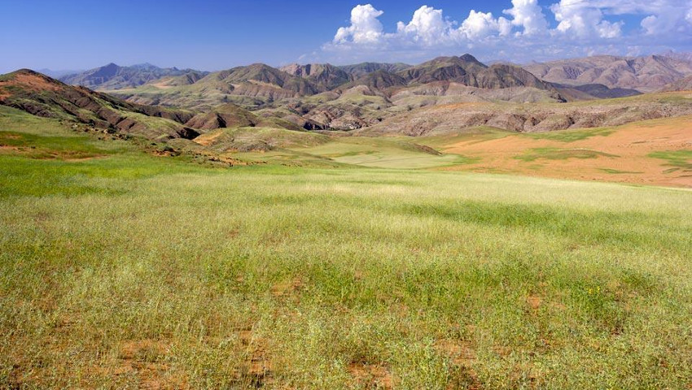
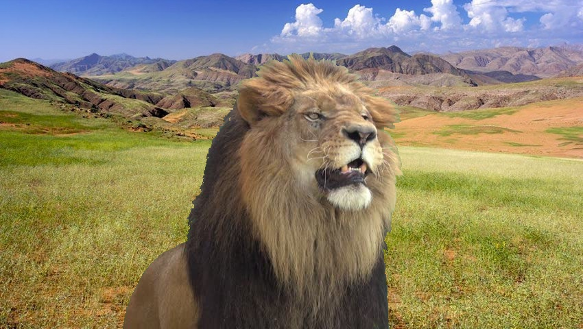

# OpenCV chroma key
A simple chroma key project . Replace green background on lion.png image with savana.png image to get result.jpg

## lion.jpg

## savana.jpg

## result.jpg

### Author
:copyright: Igor Golban
